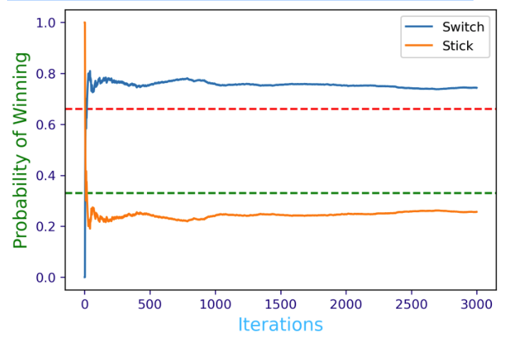

# Lab 1

## Question 1
What would be the most commonly used level of measurement if the variable is the temperature of the air?

1. **interval -- this is the answer**
2. nominal
3. ratio
4. ordinal

## Question 2
NaNs were replaced with 21.0.

```python
# data handling imports
import numpy as np
import pandas as pd
from sklearn.impute import SimpleImputer

# import the csv file
data_2 = pd.read_csv('L1Data.csv')

# set the imputing configuration
imp_config = SimpleImputer(missing_values = np.nan, strategy = 'median')

# choose column for imputation
imp = imp_config.fit(data_2_noNaN[['Age']])

# replace NaNs in data_2_noNaN
data_2_noNaN[['Age']] = imp.transform(data_2_noNaN[['Age']]).ravel()

data_2_noNaN # row 12 and 20 replaced with 21.0
```

## Question 3
In Bayesian inference the "likelihood" represents:

1. How probably is the new evidence under all possible hypotheses
2. How probably is our hypothesis given the data observations (the specific evidence we collected)
3. **How probable is the data/evidence given that our hypothesis is true -- this is the answer**
4. How probable or frequent is our hypothesis in general

## Question 4
The main goal of Monte Carlo simulations is to solve problems by approximating a probability value through carefully designed simulations.

This is **true**

## Question 5
Assume that during a pandemic...

* 15% of the population gets infected with a respiratory virus
* 35% of the population have general respiratory symptoms
* 30% of those infected are asymptomatic

What is the probablity that someone who is symptomatic has the disease?

```python

pop_infected = 0.15
pop_symptom = 0.35
pop_asymp = 0.30
pop_nasymp = 0.70

probability = ((pop_infected * pop_nasymp) / pop_symptom) * 100

probability # is 30.0
```

## Question 6
A Monte Carlo simulation should never include more than 1000 repetitions of the experiment.

This is **false**

## Question 7
One can decide that the number of iterations in a Monte Carlo simulation was sufficient by visualizing a Probability-Iteration plot and determining where the probability graph approaches a horizontal line.

This is **true**

## Question 8
Assume we play a slightly bit different version of the original Monte Hall problem such as having **four doors one car** and **three goats**. The rules of the game are the same, the contestant chooses **one door** (that remains closed) and one of the other doors who had a **goat behind it** is being opened. The contestant has to make a choice as to **stick with the original choice** or rather **switch for one of the remaining closed doors**.

```python
%matplotlib inline
%config InlineBackend.figure_format = 'retina'
import matplotlib as mpl
mpl.rcParams['figure.dpi'] = 150

import random
import matplotlib.pyplot as plt

doors = ["goat","goat", "goat", "car"]

# approximated results
switch_win_probability = []
stick_win_probability = []

plt.axhline(y=0.66, color='red', linestyle='--')
plt.axhline(y=0.33, color='green', linestyle='--')

def monte_carlo(n):

  switch_wins = 0
  stick_wins = 0

  for i in range(n):
     random.shuffle(doors)

     k = random.randrange(4)

     if doors[k] != 'car':
       switch_wins +=1

     else:
       stick_wins +=1

     switch_win_probability.append(switch_wins/(i+1))
     stick_win_probability.append(stick_wins/(i+1))

  plt.plot(switch_win_probability,label='Switch')
  plt.plot(stick_win_probability,label='Stick')
  plt.tick_params(axis='x', colors='navy')
  plt.tick_params(axis='y', colors='navy')
  plt.xlabel('Iterations',fontsize=14,color='DeepSkyBlue')
  plt.ylabel('Probability of Winning',fontsize=14,color='green')
  plt.legend()
  print('Winning probability if you always switch:', switch_win_probability[-1])
  print('Winning probability if you always stick to your original choice:', stick_win_probability[-1])

monte_carlo(3000)
```
Winning probability if you always switch: 0.7436666666666667
Winning probability if you always stick to your original choice: 0.25633333333333336

Graph of results:



## Question 9
In Python one of the libraries that we can use for generating repeated experiments in Monte Carlo simulations is:

1. matplotlib
2. math
3. **random -- It's this one**
4. pandas

## Question 10
In Python, for creating a random permutation of an array whose entries are nominal variables we used:

1. random.randint
2. random.uniform
3. **random.shuffle -- It's this one**
4. random.randrange
