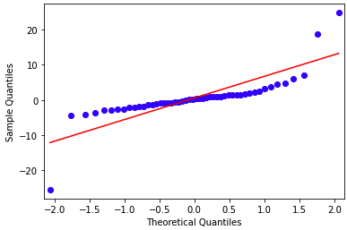

# Lab 4

## Question 1

Regularization is defined as...

* the minimization of the sum of squared residuals subject to a constraint on the weights (aka coefficients)  

## Question 2

The regularization with the square of an L2 distance may improve the results compared to OLS when the number of features is higher than the number of observations.

* true

## Question 3

The L1 norm always yields shorter distances compared to the Euclidean norm.

* false

## Question 4

Typically, the regularization is achieved by:

* minimizing the average of the squared residuals plus a penalty function whose input is the vector of coefficients.

## Question 5

A regularization method that facilitates variable selection (estimating some coefficients as zero) is:

* Lasso

## Question 6

Write your own Python code to import the Boston housing data set and to scale the data (not the target) by z-scores. If we use all the features with the Linear Regression to predict the target variable then the root mean squared error (RMSE) is: **4.6791**.

```Python

def standardize(x):
    """Standardize the original data set."""
    return (x - x.mean(axis=0))/ x.std(axis=0)

data = load_boston()
X = data.data
X_names = data.feature_names
y = data.target

# data = load_boston()

# df = pd.DataFrame(data.data)

# y = data.target
# X = standardize(df.values)

lin_reg = LinearRegression()
lin_reg.fit(X,y)
lin_reg.score(X,y)

y_pred = lin_reg.predict(X)

idxLo = y<50
y_lo = y[idxLo]
X_lo = X[idxLo]
lin_reg_lo = LinearRegression()
lin_reg_lo.fit(X_lo, y_lo)
lin_reg_lo.score(X_lo, y_lo)

prices = y
predicted = y_pred

summation = 0
n = len(predicted)
for i in range (0,n):
    difference = prices[i] - predicted[i]
    squared_difference = difference**2
    summation = summation + squared_difference

    
rmse = np.sqrt(metrics.mean_squared_error(prices, predicted))
    
MSE = summation/n
print ("The rmse is: ", rmse)
```

## Question 7

On the Boston housing data set if we consider the Lasso model with 'alpha=0.03' then the 10-fold cross-validated prediction error is: **4.8370**.

```Python
kf = KFold(n_splits=10, random_state=1234,shuffle=True)
data = load_boston()
df = pd.DataFrame(data=data.data, columns=data.feature_names)
y = data.target

PE = []
lm = Lasso(alpha=0.03)
for train_index, test_index in kf.split(df):
    X_train = df.values[train_index]
    y_train = y[train_index]
    X_test = df.values[test_index]
    y_test = y[test_index]
    model = lm.fit(X_train, y_train)
    y_pred = lm.predict(X_test)
    PE.append(np.sqrt(metrics.mean_squared_error(y_test, y_pred)))
    # print('RMSE from each fold:',np.sqrt(MSE(y_test, y_pred)))
```

## Question 8

On the Boston housing data set if we consider the Elastic Net model with 'alpha=0.05' and 'l1_ratio=0.9' then the 10-fold cross-validated prediction error is: **4.8965**.

```Python
kf = KFold(n_splits=10, random_state=1234,shuffle=True)
data = load_boston()
df = pd.DataFrame(data=data.data, columns=data.feature_names)
y = data.target

PE = []
lm = ElasticNet(alpha=0.05, l1_ratio=0.9)
for train_index, test_index in kf.split(df):
    X_train = df.values[train_index]
    y_train = y[train_index]
    X_test = df.values[test_index]
    y_test = y[test_index]
    model = lm.fit(X_train, y_train)
    y_pred = lm.predict(X_test)
    PE.append(np.sqrt(metrics.mean_squared_error(y_test, y_pred)))
```

## Question 9

If we create all quadratic polynomial (degree=2) features based on the z-scores of the original features and then apply OLS, the root mean squared error is: **2.4486**. 

I initially got the wrong answer because I applied OLS incorrectly.

```python
data = load_boston()

df = pd.DataFrame(data.data)

y = data.target
x = standardize(df.values)

kf = KFold(n_splits=10, shuffle=True, random_state=1234)

model = LinearRegression()
polynomial_features= PolynomialFeatures(degree=2)

PE = []

for idxtrain, idxtest in kf.split(x):
    x_train = x[idxtrain, :]
    x_test = x[idxtest, :]
    y_train = y[idxtrain]
    y_test  = y[idxtest]
    x_poly_train = polynomial_features.fit_transform(x_train)
    x_poly_test = polynomial_features.fit_transform(x_test)
    model.fit(x_poly_train,y_train)
    yhat_train = model.predict(x_poly_train)
    yhat_test = model.predict(x_poly_test)
    PE.append(np.sqrt(metrics.mean_squared_error(y_test, yhat_test)))
```

## Question 10

If we create all quadratic polynomial (degree=2) features based on the z-scores of the original features and then apply the Ridge regression with alpha=0.1 and we create a Quantile-Quantile plot for the residuals then the result shows that  the obtained residuals pretty much follow a normal distribution.

* true

I intially said the answer was false, but my error was saying that the data didn't completely follow a normal distribution. In general, the data does, my assessment was too strict.


