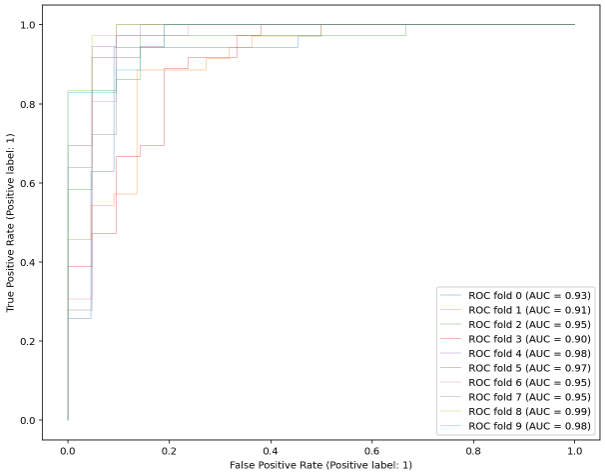

# Lab 5

## Multiple Choice Questions
1. MC1 -- In the case of kernel Support Vector Machines for classification, such as  the radial basis function kernel, one or more landmark points are considered by the algorithm.
2. MC2 -- A hard margin SVM is NOT appropriate for data which is not linearly separable.
3. MC3 -- In K-nearest neighbors, all observations that fall within a circle with radius of K are included in the estimation for a new point.
5. MC5 -- Kernel SVM is NOT only applicable if you have at least 3 independent variables (3 dimensions).
10. MC10 -- Simple linear regression (OLS) is not well suited to calculating the probability of discrete cases because it can result in predicted probabilities greater than 1 or less than 0.
11. MC11 -- When applying the K - Nearest Neighbors classifier we DO NOT always get better results if the weights are changed from 'uniform' to 'distance'.

## Practical Questions

### Data Preprocessing

```python
data = load_breast_cancer()
X = data.data
X_names = data.feature_names
y = data.target

df = pd.DataFrame(X, columns=X_names)
#####################################
features = ['mean radius', 'mean texture']
X_filt = df[features].values
y_filt = data.target

ss = StandardScaler()
Xs = ss.fit_transform(X_filt)
```

### Question 4

```python
df.shape

((25)*(569))/100
569 - 142.25

# answer is 426.75
```

### Question 6

```python
X_train = X_filt
scaler = StandardScaler().fit(X_train)
X_train_scaled = scaler.transform(X_train)
new_data = np.array([[16.78, 17.89]])
new_data_scaled = scaler.transform(new_data)

model = svm.SVC(kernel='rbf')
model.fit(X_train_scaled,y_filt)

predicted = model.predict(new_data_scaled)
print(predicted) # -> Malignant (I got this wrong because I mixed up target labels)
```

### Question 7

```python
X_train = X_filt
scaler = StandardScaler().fit(X_train)
X_train_scaled = scaler.transform(X_train)
new_data = np.array([[15.78, 17.89]])
new_data_scaled = scaler.transform(new_data)

model = LogisticRegression()
model.fit(Xs,y_filt)

predicted = model.predict_proba(new_data_scaled)
print(predicted) # -> 61%
```

### Question 8

```python
X_train = X_filt
scaler = StandardScaler().fit(X_train)
X_train_scaled = scaler.transform(X_train)
new_data = np.array([[17.18, 8.65]])
new_data_scaled = scaler.transform(new_data)

model = neighbors.KNeighborsClassifier(n_neighbors=5, weights='uniform')
model.fit(X_train_scaled,y_filt)

predicted = model.predict(new_data_scaled)
print(predicted) # -> answer is benign (I got this wrong because I mixed up target labels)
```

### Question 9

```python
classifier = RandomForestClassifier(random_state=1234, max_depth=5, n_estimators = 100)

X = X_filt
y = y_filt

cv = StratifiedKFold(n_splits=10)
tprs = []
aucs = []

mean_fpr = np.linspace(0, 1, 100) # should I use this???

fig, ax = plt.subplots(figsize=(10,8))
for i, (train, test) in enumerate(cv.split(X, y)):
    classifier.fit(X[train], y[train])
    viz = plot_roc_curve(classifier, X[test], y[test],
                         name='ROC fold {}'.format(i),
                         alpha=0.3, lw=1, ax=ax)
    interp_tpr = np.interp(mean_fpr, viz.fpr, viz.tpr)
    interp_tpr[0] = 0.0
    tprs.append(interp_tpr)
    aucs.append(viz.roc_auc)

mean_tpr = np.mean(tprs, axis=0)
mean_tpr[-1] = 1.0
mean_auc = auc(mean_fpr, mean_tpr)

print(mean_auc) # --> 0.9494195927529261
```


