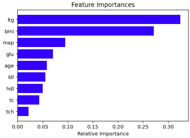

# Lab 7

## MC Questions

## Practical Questions

* Question 4
    * A k-fold cross-validation can be used to determine the best choice of hyper-parameters from a finite set of choices -- True
* Question 8
    * Maximum depth, minimum node size, and learning rate are all examples of what type of parameters? -- Hyper-parameters
* Question 9
    * Selecting an appropriate model requires -- Both knowing the nature of your problem and the nature of your model (in terms of linearity).
* Question 10
    * A good reason for implementing a feature selection technique is -- All of the above
* Question 11
    * The concept of principal component analysis refers to -- Determining the directions along which we maximize the variance of the input features.

________________________
### Preprocessing: Diabetes Dataset

```python
columns = 'age gender bmi map tc ldl hdl tch ltg glu'.split()
diabetes = datasets.load_diabetes()
df = pd.DataFrame(diabetes.data, columns=columns)
y = diabetes.target
```
________________________

### Question 1

```python
rf_class = RandomForestRegressor(random_state=310, max_depth=10, n_estimators = 1000)
rf_class.fit(df,y)

features = df.columns
importances = rf_class.feature_importances_
indices = np.argsort(importances)[-9:]  

plt.title('Feature Importances')
plt.barh(range(len(indices)), importances[indices], color='b', align='center')
plt.yticks(range(len(indices)), [features[i] for i in indices])
plt.xlabel('Relative Importance')
plt.show()
```



### Question 2

```python
def stepwise_selection(X, y,
                       initial_list=[],
                       threshold_in=0.01,
                       threshold_out = 0.05,
                       verbose=True):
    """ Perform a forward-backward feature selection
    based on p-value from statsmodels.api.OLS
    Arguments:
        X - pandas.DataFrame with candidate features
        y - list-like with the target
        initial_list - list of features to start with (column names of X)
        threshold_in - include a feature if its p-value < threshold_in
        threshold_out - exclude a feature if its p-value > threshold_out
        verbose - whether to print the sequence of inclusions and exclusions
    Returns: list of selected features
    Always set threshold_in < threshold_out to avoid infinite looping.
    See https://en.wikipedia.org/wiki/Stepwise_regression for the details """

    included = list(initial_list)
    while True:
        changed=False
        # forward step
        excluded = list(set(X.columns)-set(included))
        new_pval = pd.Series(index=excluded)
        for new_column in excluded:
            model = sm.OLS(y, sm.add_constant(pd.DataFrame(X[included+[new_column]]))).fit()
            new_pval[new_column] = model.pvalues[new_column]
        best_pval = new_pval.min()
        if best_pval < threshold_in:
            best_feature = new_pval.idxmin()
            included.append(best_feature)
            changed=True
            if verbose:
                print('Add  {:30} with p-value {:.6}'.format(best_feature, best_pval))

        # backward step
        model = sm.OLS(y, sm.add_constant(pd.DataFrame(X[included]))).fit()
        # use all coefs except intercept
        pvalues = model.pvalues.iloc[1:]
        worst_pval = pvalues.max() # null if pvalues is empty
        if worst_pval > threshold_out:
            changed=True
            worst_feature = pvalues.idxmax()
            included.remove(worst_feature)
            if verbose:
                print('Drop {:30} with p-value {:.6}'.format(worst_feature, worst_pval))
        if not changed:
            break
    return included

result = stepwise_selection(X_d,y_d,[],0.001,0.001)
```

### Question 3

```python
Xs_d = scale.fit_transform(X_d)
model = ElasticNet(alpha=0.1, l1_ratio=0.5)
model.fit(Xs_d, y_d)
model.coef_

list(X_d.columns[np.abs(model.coef_)>1e-1])
X_d.shape[1]

v = -np.sort(-np.abs(model.coef_))
for i in range(X_d.shape[1]):
    print(X_d.columns[np.abs(model.coef_)==v[i]])
```
________________________
### Preprocessing Breast Cancer Dataset
```python
data = load_breast_cancer()

df = pd.DataFrame(data.data, columns=data.feature_names)
feats = ['mean radius', 'mean texture']

X = df[feats].values
y = data.target
```
________________________

### Question 5
```python
model = tree.DecisionTreeClassifier(random_state=1693)
params = [{'max_depth':np.linspace(1, 100, 100).astype(int),
           'min_samples_leaf':np.linspace(1, 25, 25).astype(int)}]

gs = GridSearchCV(estimator=model,cv=10,scoring='accuracy',param_grid=params)
gs_results = gs.fit(X, y)

print(gs_results.best_params_) # --> {'max_depth': 4, 'min_samples_leaf': 23}
print(f'Accuracy is: {gs_results.best_score_}')
```

### Question 6
```python
# do k fold and parameter filtering
model = tree.DecisionTreeClassifier(random_state=12345)
params = [{'max_depth':np.linspace(1, 100, 100).astype(int),
           'min_samples_leaf':np.linspace(1, 25, 25).astype(int)}]

gs = GridSearchCV(estimator=model,cv=10,scoring='neg_mean_squared_error',param_grid=params)
gs_results = gs.fit(X, y)

print(gs_results.best_params_)

# output false negatives
dt_class = tree.DecisionTreeClassifier(random_state=12345, max_depth=4, min_samples_leaf=23)
dt_class.fit(X, y)
y_b_pred = dt_class.predict(X)
dt_cm = confusion_matrix(y, y_b_pred)

dt_cm
```

### Question 7
```python
# do k fold and parameter filtering
model = tree.DecisionTreeClassifier(random_state=1693)
params = [{'max_depth':np.linspace(1, 100, 100).astype(int),
           'min_samples_leaf':np.linspace(1, 25, 25).astype(int)}]

gs = GridSearchCV(estimator=model,cv=10,scoring='neg_mean_squared_error',param_grid=params)
gs_results = gs.fit(X, y)

print(gs_results.best_params_)

# output accuracy
def validation(X,y,k,model):
    PA_IV = []
    PA_EV = []
    pipe = Pipeline([('scale',scale),('Classifier',model)])
    kf = KFold(n_splits=k,shuffle=True,random_state=1693)
    for idxtrain, idxtest in kf.split(X):
        X_train = X[idxtrain,:]
        y_train = y[idxtrain]
        X_test = X[idxtest,:]
        y_test = y[idxtest]
        pipe.fit(X_train,y_train)
        PA_IV.append(accuracy_score(y_train,pipe.predict(X_train)))
        PA_EV.append(accuracy_score(y_test,pipe.predict(X_test)))
    return np.mean(PA_IV), np.mean(PA_EV)

model = tree.DecisionTreeClassifier(random_state=1693, max_depth=4, min_samples_leaf=23)
validation(X, y, 10, model) # --> 89%
```

### Question 12
```python
df12 = pd.DataFrame(data.data, columns = data.feature_names)
X = df12.values
y = data.target

pca = PCA(n_components=9)
model = tree.DecisionTreeClassifier(random_state=1234, max_depth=10, min_samples_leaf=20)

principalComponents = pca.fit_transform(X)
model.fit(principalComponents, y)

y_pred = model.predict(principalComponents)
dt_cm = confusion_matrix(y, y_pred)

dt_cm
```
