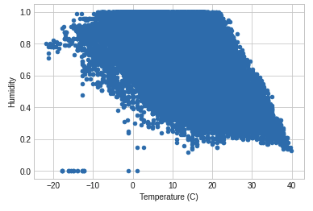

# Midterm Workspace Code

## Question 1
```python
# question 1
data = pd.read_csv('weatherHistory.csv')
data.shape # --> (96453, 12)```

## Question 2
```python

# question 2
data.head(1)```

From looking at the data, I determined that there were three nominal features; summary, precip type, and daily summary.

## Question 3
```python

# question 3
X3 = data[['Temperature (C)']].to_numpy()
y3 = data[['Humidity']].to_numpy()
linear_model = LinearRegression().fit(X3, y3)
ypred3 = linear_model.predict(X3)
rmse = np.sqrt(mean_squared_error(y3, ypred3))

rmse # --> 0.1514437964005473```

## Question 4
```python

# question 4
def DoKFold(model, X, y, k, standardize, random_state):
    if standardize:
        from sklearn.preprocessing import StandardScaler as SS
        ss = SS()

    kf = KFold(n_splits=k, shuffle=True, random_state=random_state)

    train_scores = []
    test_scores = []
    PE = []

    for idxTrain, idxTest in kf.split(X):
        Xtrain = X[idxTrain, :]
        Xtest = X[idxTest, :]
        ytrain = y[idxTrain]
        ytest = y[idxTest]

        if standardize:
            Xtrain = ss.fit_transform(Xtrain)
            Xtest = ss.transform(Xtest)

        model.fit(Xtrain, ytrain)

        ypred = model.predict(Xtest)

        train_scores.append(model.score(Xtrain, ytrain))
        test_scores.append(model.score(Xtest, ytest))
        PE.append(np.sqrt(mean_squared_error(ytest, ypred)))

    return train_scores, test_scores, PE

X4 = X3
y4 = y3
model = Ridge(alpha=0.1)
train_scores, test_scores, PE = DoKFold(model, X4, y4, 20, True, 2020)
avg_rmse = np.mean(PE)

avg_rmse # --> 0.15143825148125584```

## Question 5
```python

# question 5
def DoKFoldPoly(model, X, y, k, d, standardize, random_state):
    if standardize:
        from sklearn.preprocessing import StandardScaler as SS
        ss = SS()

    kf = KFold(n_splits=k, shuffle=True, random_state=random_state)

    train_scores = []
    test_scores = []
    PE = []

    polynomial_features = PolynomialFeatures(degree=d)

    for idxTrain, idxTest in kf.split(X):
        x_train = X[idxTrain]
        x_test = X[idxTest]
        y_train = y[idxTrain]
        y_test = y[idxTest]

        x_poly_train = polynomial_features.fit_transform(np.array(x_train))
        x_poly_test = polynomial_features.fit_transform(np.array(x_test))

        model.fit(x_poly_train,y_train)

        yhat_train = model.predict(x_poly_train)
        yhat_test = model.predict(x_poly_test)

        if standardize:
            x_train = ss.fit_transform(x_poly_train)
            x_test = ss.transform(x_poly_test)

#         train_scores.append(model.score(x_train, y_train))
#         test_scores.append(model.score(x_test, y_test))
        PE.append(np.sqrt(mean_squared_error(y_test, yhat_test)))

    return train_scores, test_scores, PE

X5 = data[['Apparent Temperature (C)']].to_numpy()
y5 = y4
model = LinearRegression()

train_scores, test_scores, PE = DoKFoldPoly(model, X5, y5, 10, 6, True, 1693)
avg_rmse = np.mean(PE)

avg_rmse # --> 0.14346597195873528```

## Question 6
```python

def RMSE(y,yhat):
    n = len(y)
    return np.sqrt(np.sum((y-yhat) ** 2)/n)

    # question 6
    def DoKFoldTree(X, y, model, k):
        PE1 = []
        PE2 = []
        kf = KFold(n_splits=k, shuffle=True, random_state=1234)
        for idxtrain,idxtest in kf.split(X):
            Xtrain = X[idxtrain,:]
            Xtest = X[idxtest,:]
            ytrain = y[idxtrain]
            ytest = y[idxtest]
            model.fit(Xtrain, ytrain)
            yhat = model.predict(Xtest)
            #PE1.append(MAE(ytest,yhat))
            PE2.append(RMSE(ytest,yhat))
            #PE2.append(np.sqrt(mean_squared_error(ytest,yhat)))
        return np.mean(PE1), np.mean(PE2)

    X6 = data[['Apparent Temperature (C)']].to_numpy()
    y6 = data[['Humidity']].to_numpy()

    model = RandomForestRegressor(n_estimators=100,max_depth=50)
    #DoKFoldTree(X6, y6, model, 10) # --> (nan, 23882.75628862717)```

## Question 7
```python

# question 7
def DoKFold(model, X, y, k, standardize, random_state):
    if standardize:
        from sklearn.preprocessing import StandardScaler as SS
        ss = SS()

    kf = KFold(n_splits=k, shuffle=True, random_state=random_state)

    train_scores = []
    test_scores = []
    PE = []

    for idxTrain, idxTest in kf.split(X):
        Xtrain = X[idxTrain]
        Xtest = X[idxTest]
        ytrain = y[idxTrain]
        ytest = y[idxTest]

        if standardize:
            Xtrain = ss.fit_transform(Xtrain)
            Xtest = ss.transform(Xtest)

        model.fit(Xtrain, ytrain)

        ypred = model.predict(Xtest)

        train_scores.append(model.score(Xtrain, ytrain))
        test_scores.append(model.score(Xtest, ytest))
        PE.append(np.sqrt(mean_squared_error(ytest, ypred)))

    return train_scores, test_scores, PE

X7 = X3
y7 = y3
model = Ridge(alpha=0.2)
train_scores, test_scores, PE = DoKFold(model, X7, y7, 10, True, 1234)
avg_rmse = np.mean(PE)

avg_rmse # --> 0.15144461669159875```

## Question 8
```python

# question 8
X8 = data[['Humidity', 'Wind Speed (km/h)', 'Pressure (millibars)', 'Wind Bearing (degrees)']].to_numpy()
y8 = data[['Temperature (C)']].to_numpy()
model = LinearRegression()

train_scores, test_scores, PE = DoKFoldPoly(model, X8, y8, 10, 6, True, 1234)
avg_rmse = np.mean(PE)

avg_rmse # --> 6.127033222535402```

## Question 9
```python

# question 9
X6 = X8
y6 = np.ravel(y8)

model = RandomForestRegressor(n_estimators=100,max_depth=50)
DoKFoldTree(X6, y6, model, 10) # --> 5.829853854675095```

## Question 10
```python

# question 10
x = data['Temperature (C)']
y = data['Humidity']

data.plot(x = 'Temperature (C)', y = 'Humidity', kind = 'scatter')
plt.show()```


